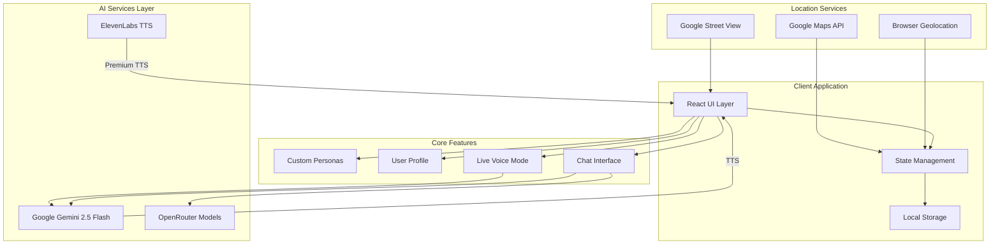

# StoryWalker AI

Your Personal AI Tour Guide That Adapts to You

StoryWalker AI creates a fully personalized tour guide experience powered by Google Gemini. Define your interests, preferred storytelling style, and topics to avoid — the AI adapts everything to match. Whether walking through a real city or exploring virtually through Google Street View, your guide tells stories that resonate with you personally.

<p align="center">
  
  
  
</p>

## Architecture (The Big Picture)

The application follows a client-side architecture where all AI processing happens through external APIs, keeping your data private and your API keys secure on your device.



### Layer Breakdown

**Client Application** is a React 19 SPA that runs entirely in the browser. All state is managed locally with React hooks, and user preferences are persisted to localStorage. No backend server required.

**AI Services Layer** handles all intelligence. Google Gemini powers text generation, image creation, TTS, and live audio conversations. OpenRouter provides access to alternative models for different storytelling styles. ElevenLabs offers premium voice synthesis.

**Location Services** enable both virtual and real-world exploration. GPS provides your current location for context-aware stories. Google Street View allows virtual tours of any city. Google Maps API handles geocoding and place information.

**Core Features** include customizable AI personas with distinct personalities, user profiles that shape how stories are told, a chat interface for text interaction, and live voice mode for hands-free exploration.

## Tech Stack

| Category | Technology | Purpose |
|----------|------------|---------|
| Framework | React 19 | UI components and state management |
| Language | TypeScript | Type-safe development |
| Build Tool | Vite | Fast development and optimized builds |
| AI Core | Google Gemini 2.5 Flash | Text, images, TTS, live audio, search grounding |
| Alternative AI | OpenRouter | Access to Mythomax, Llama, WizardLM, etc. |
| Voice | ElevenLabs | Premium voice synthesis |
| Maps | Google Maps + Street View | Virtual tours and location services |
| Icons | Lucide React | Consistent icon system |
| Styling | Tailwind CSS | Utility-first styling |

### Why This Stack?

This stack was chosen to provide **maximum privacy** with **zero backend costs**. React 19 enables a fully client-side application where API keys never leave your device. Google Gemini offers the best price-to-performance ratio for multimodal AI (text, images, audio, vision) in a single API. Vite ensures fast development iteration and optimized production builds.

## User Flow

A typical session with StoryWalker AI:

1. **Setup** - Enter your Gemini API key in Settings (one-time)
2. **Personalize** - Create a traveler profile describing your interests and preferred storytelling style
3. **Choose Guide** - Select from built-in personas or create custom characters with unique personalities
4. **Explore** - Use GPS for real-world tours or Google Street View for virtual exploration
5. **Interact** - Ask questions via text, voice, or by sharing photos of what you see
6. **Listen** - Hear responses in your guide's unique voice with optional AI-generated visuals

## Installation via Docker Compose

### Prerequisites

- Docker and Docker Compose installed
- Gemini API key (free from [Google AI Studio](https://ai.google.dev/))

### Quick Start

```bash
# Clone the repository
git clone https://github.com/IShalkin/Stone.git
cd Stone

# Start the application
docker-compose up -d
```

The app will be available at `http://localhost:3000`. Open Settings (gear icon) and enter your API keys.

### Manual Installation

Prerequisites: Node.js v18 or higher

```bash
git clone https://github.com/IShalkin/Stone.git
cd Stone
npm install
npm run dev
```

## API Keys Configuration

All API keys are entered through the in-app Settings modal. Your keys stay on your device and are never sent anywhere except to the respective API providers.

| API Key | Required | Purpose | Get It |
|---------|----------|---------|--------|
| Gemini | Yes | Core AI features | [Google AI Studio](https://ai.google.dev/) |
| Google Maps | No | Street View virtual tours | [Google Cloud Console](https://console.cloud.google.com/) |
| OpenRouter | No | Alternative AI models | [OpenRouter](https://openrouter.ai/) |
| ElevenLabs | No | Premium voice synthesis | [ElevenLabs](https://elevenlabs.io/) |

## Key Features

**Deep Personalization** - Create detailed profiles describing your interests (history, architecture, legends, food, art) and communication preferences (academic, humorous, brief, poetic). Build custom guide personas with unique voices and personalities.

**Virtual Tours** - Explore any city through Google Street View integration. Navigate streets, look around, and ask your guide about anything you see.

**Real-World Mode** - GPS-powered location awareness with camera support. Point at buildings, paste photos, or ask about your surroundings.

**Voice Interaction** - Every response can be played as audio. Live Mode enables real-time voice conversations for hands-free exploration.

**AI Visuals** - Your guide can generate images showing historical views or artistic interpretations of stories.

## Multi-Language Support

Interface and AI responses available in English, Russian, and Czech.

## Browser Permissions

The app may request: geolocation (location-based stories), camera (photo capture), microphone (Live mode voice).

## License

[CC BY-NC 4.0](LICENSE) — free for personal and non-commercial use only.
