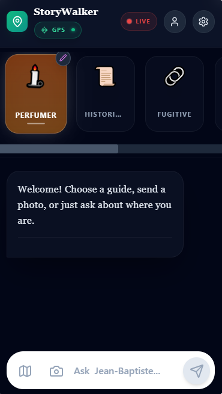
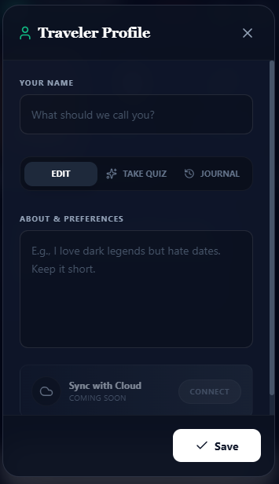
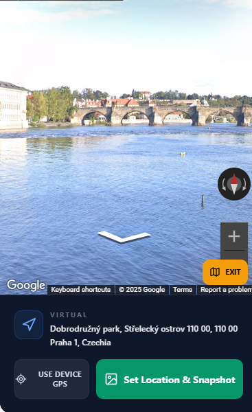

# StoryWalker AI

Your personal AI tour guide that adapts to you — not the other way around.

## Screenshots

<p align="center">
  
  
  
</p>

## The Problem

Traditional tour guides are expensive, often unavailable, and rarely match your personal interests. Group tours follow rigid scripts that ignore what actually fascinates you. Audio guides drone on about dates and facts you'll forget in minutes. What if you could have a personal guide who knows exactly what you love, speaks in a style you enjoy, and is available anytime, anywhere?

## The Solution

StoryWalker AI creates a fully personalized tour guide experience. You define your interests, preferred storytelling style, and what you want to avoid — the AI adapts everything to match. Whether you're walking through a real city or exploring virtually through Google Street View, your guide tells stories that resonate with you personally.

## Key Features

### Deep Personalization

The core of StoryWalker is personalization. Create a detailed profile describing your interests (history, architecture, dark legends, food culture, art), your preferred communication style (academic, humorous, brief, poetic), and topics you find boring. The AI uses this profile to tailor every response specifically for you.

Beyond profiles, you can create entirely custom guide personas. Want a grumpy pirate who tells sea legends? A scholarly cat who explains architecture? An old friend who shares local gossip? Use the AI Builder to generate unique characters with distinct voices, personalities, and storytelling approaches. The included personas (Perfumer, Historian, Prisoner, Gossip, Cinematographer) are just starting examples — the real magic happens when you create guides that match your imagination.

### Virtual Tours with Google Street View

Don't need to travel to explore. StoryWalker integrates with Google Street View, allowing you to take virtual walks through any city in the world. Navigate streets, look around, and ask your personalized guide about anything you see. Plan future trips, revisit places you've been, or explore cities you may never visit in person — all with a guide who knows exactly what interests you.

### Real-World Exploration

When you're actually traveling, StoryWalker uses your GPS location to provide context-aware stories. Point your camera at a building, paste a photo, or simply ask about your surroundings. The AI fetches real-time information through Google Search and Maps to give you accurate, current details mixed with the storytelling style you prefer.

### Voice Interaction

Every response can be played as audio with persona-specific voices. In Live Mode, have a real-time conversation with your guide using your microphone — perfect for hands-free exploration while walking. Choose between built-in Gemini TTS voices or connect ElevenLabs for premium voice synthesis.

### AI-Generated Visuals

Your guide can generate images to illustrate stories — photorealistic shots of how places looked historically, or artistic interpretations of legends and atmospheres described in the narrative.

## Tech Stack

React 19 with TypeScript, Vite, Google Gemini 2.5 Flash (text, image generation, TTS, live audio), Lucide React icons, and Tailwind CSS.

## Getting Started

This is an open-source project with no hardcoded API keys. All API keys are entered by you through the in-app Settings modal at runtime — your keys stay on your device and are never sent anywhere except to the respective API providers.

### API Keys (All Entered in Settings)

**Required:**
- **Gemini API Key** — Powers all core AI features: text generation, image generation, text-to-speech, live audio conversations, and Google Search grounding. Get it free from [Google AI Studio](https://ai.google.dev/).

**Optional:**
- **Google Maps API Key** — Enables Google Street View for virtual tours. Without it, the app falls back to OpenStreetMap (no Street View). Requires Maps JavaScript API, Street View Static API, and Geocoding API enabled in Google Cloud Console.
- **OpenRouter API Key** — Access alternative AI models (Mythomax, Llama, WizardLM, etc.) for different storytelling styles.
- **ElevenLabs API Key** — Premium voice synthesis with more realistic voices. Without it, the app uses built-in Gemini TTS.

### Option 1: Docker Compose (Recommended)

```bash
git clone https://github.com/IShalkin/Stone.git
cd Stone
docker-compose up -d
```

The app will be available at `http://localhost:3000`. Open Settings (gear icon) and enter your API keys.

### Option 2: Manual Installation

Prerequisites: Node.js v18 or higher

```bash
git clone https://github.com/IShalkin/Stone.git
cd Stone
npm install
npm run dev
```

Open the app in your browser and go to Settings (gear icon) to enter your API keys.

## Multi-Language Support

Interface and AI responses available in English, Russian, and Czech.

## Permissions

The app may request browser permissions for geolocation (location-based stories), camera (photo capture), and microphone (Live mode voice interaction).

## License

This project is licensed under [CC BY-NC 4.0](LICENSE) — free for personal and non-commercial use only.
